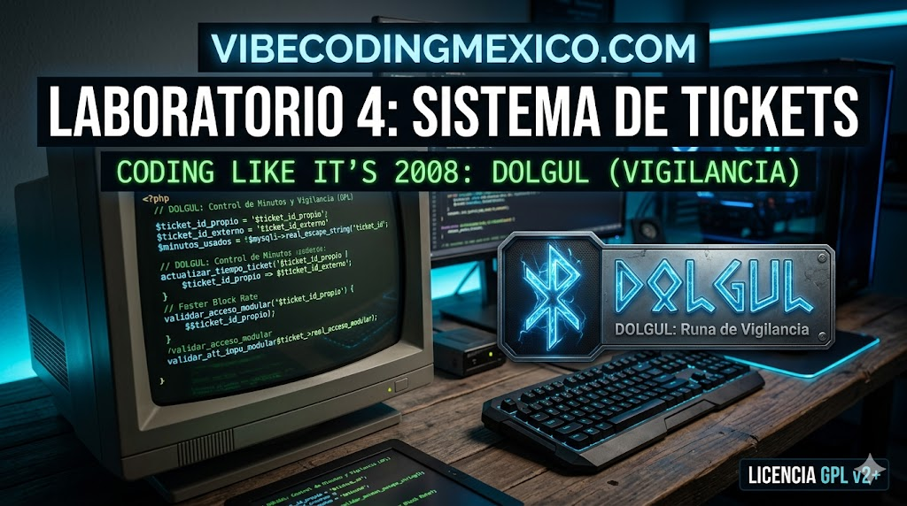

# 🛡️ DOLGUL - Sistema de Tickets (Vigilancia)

**DOLGUL** (del islandés: "Vigilancia") es un sistema de gestión de tickets y mesa de ayuda diseñado bajo la filosofía de **Vigilancia Técnica**. Es el resultado del **Laboratorio 4** de **Vibe Coding** realizado en marzo de 2026, enfocado en la integridad de datos y la contabilidad estricta de tiempos para consultoría técnica.

La misión: Evaluar a **Grok (xAI)** como arquitecto de lógica de negocio pesada, manteniendo el control humano sobre la seguridad y la arquitectura de datos procedural en PHP 8.x.

Proyecto
https://vibecodingmexico.com/laboratorio-4-tickets-multiempresa/
---

## ⚠️ Estado del Laboratorio (Bitácora de Control)

Este sistema ha sido verificado mediante un módulo de auditoría interna de integridad. A diferencia de otros experimentos, **DOLGUL** nació con un enfoque de producción resiliente:

* **Integridad de Datos:** Se implementó una lógica de prevención de "basura" en la base de datos, rechazando alucinaciones de código que intentaron corromper los registros SQL.
* **Contabilidad de Minutos:** El sistema calcula automáticamente el saldo de horas contratadas vs. consumidas por empresa, alertando visualmente sobre excesos.
* **Seguridad Estricta:** Implementación de niveles de acceso (Admin, Consultor, Usuario) validados en cada componente.
* **Dependencia de Header:** El sistema es modular; la ausencia del archivo `headergrok.php` inhabilita la ejecución por seguridad (Single Point of Failure intencional).

---

## 🛠️ Especificaciones Técnicas

* **Ambiente:** Optimizado para servidores cPanel y PHP 8.x (Programación Procedural).
* **Base de Datos:** MySQL / MariaDB con motor InnoDB para garantizar integridad referencial.
* **Frontend:** Bootstrap 4.6 y Font Awesome, con un diseño sobrio, profesional y de alta legibilidad.
* **Licencia:** **GPL v3**. Este software es libre: puedes estudiarlo, modificarlo y compartirlo, garantizando que las mejoras siempre regresen a la comunidad bajo los mismos términos.

---

## 📂 Guía de Inicio y Auditoría

1.  **Base de Datos:** Ejecuta el script SQL correspondiente para crear las tablas de categorías, prioridades, empresas, usuarios y la tabla maestra de tickets.
2.  **Configuración:** Crea tu archivo `config.php` con la variable `$link` para la conexión centralizada.
3.  **Verificación de Integridad:** El sistema incluye `dolgulfiles.php`. Ejecútalo inmediatamente después de subir el repositorio para validar:
    * Presencia de los 22 archivos núcleo.
    * Conteo de líneas de código por archivo.
    * **Hash SHA-1** para asegurar que ningún archivo fue alterado o corrompido durante la transferencia.

---

## 📸 Galería del Laboratorio 4

### 1. Dashboard General (Torre de Control)
Centro de mando con filtros multidimensionales (Empresa, Usuario, Sistema, Proceso) para supervisar el estado global de la operación.

### 2. Reporte de Minutos (Contabilidad)
Módulo crítico que muestra el consumo de tiempo real y el saldo de la póliza contratada, permitiendo una vigilancia financiera precisa.

### 3. Auditoría de Integridad (dolgulfiles)
Monitor de salud que firma digitalmente cada componente del sistema mediante SHA-1, garantizando que el código en ejecución es el auditado.

---

## 🧪 Notas del Autor (Filosofía Vibecoding)

Este proyecto forma parte de la serie de experimentos en **[vibecodingmexico.com](https://vibecodingmexico.com)**. Mi enfoque es la **Programación Real**: la que sobrevive a servidores compartidos, redes inestables y auditorías contables.

Mi nombre es **Alfonso Orozco Aguilar**, mexicano, programador desde 1991. En 2026 compagino mi carrera como DevOps Senior con la licenciatura en Contaduría.

**Hallazgo del Laboratorio 4:** Grok demostró ser un arquitecto de lógica contable capaz, pero con tendencia a "despreciar" la integridad de los datos si no hay una supervisión humana de tres décadas de experiencia guiando el prompt. La IA puede alucinar código, pero un profesional no puede permitirse alucinar datos.

---

## ⚖️ Licencia
Este proyecto se distribuye bajo la licencia **GNU GPL v3**. He elegido esta licencia para asegurar que DOLGUL permanezca como una herramienta abierta, libre y protegida contra el cierre de código derivado.

---

## ✍️ Acerca del Autor
* **Sitio Web:** [vibecodingmexico.com](https://vibecodingmexico.com)
* **Facebook:** [Perfil de Alfonso Orozco Aguilar](https://www.facebook.com/alfonso.orozcoaguilar)
* **Ubicación:** Ciudad de México.
